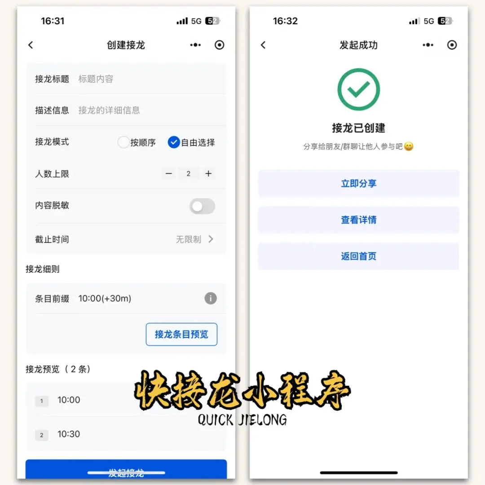
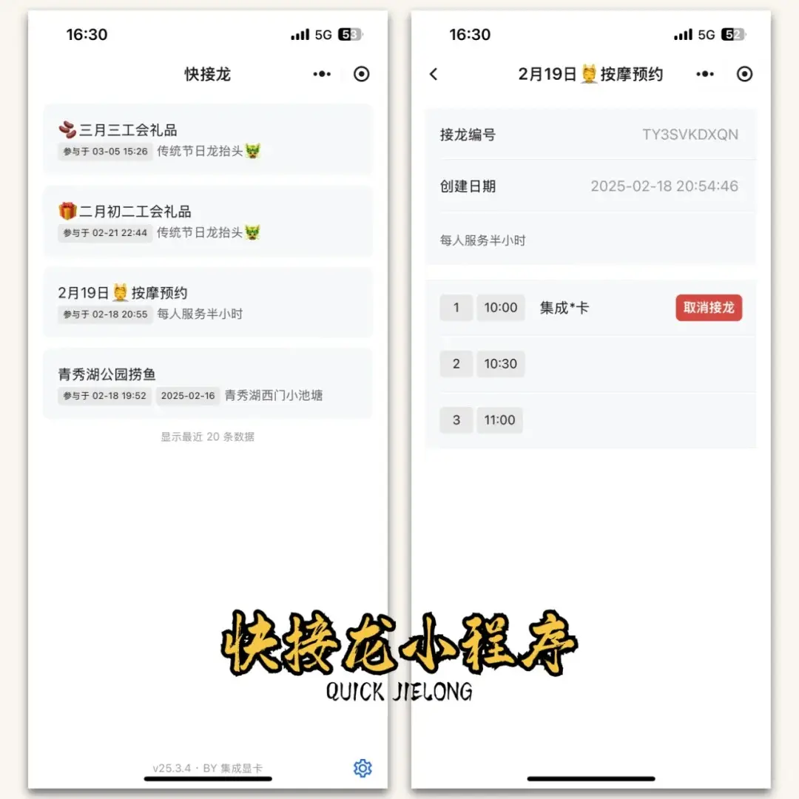
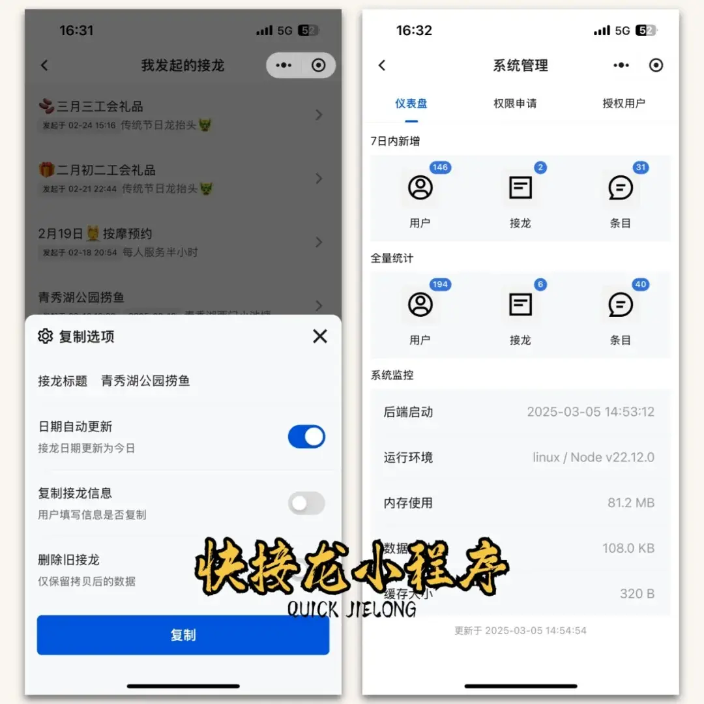

# 快接龙
> QUICK-JIELONG

简单有效的接龙形式信息收集工具

**📒 系列博客**

* [快接龙 | 一款简单高效微信小程序的设计与实现](https://blog.csdn.net/ssrc0604hx/article/details/145732357)
* [快接龙 | 个人开发者上架微信小程序要多少钱？](https://blog.csdn.net/ssrc0604hx/article/details/145733531)

**📷 运行预览**

## 🧑‍💻 开发说明

### 🛠️ 小程序调整

小程序上线审核被拒：`你的小程序涉及用户自行生成内容的发布/分享/交流，属社交范畴，为个人主体小程序未开放类目，建议申请企业主体小程序`

针对此问题，做一下修改：

- [x] 角色：管理员（仪表盘）、发布者（发起接龙）
- [x] 仅授权人员可发布接龙
- [x] 首页为近30天（可配置）我参与的接龙记录
- [x] 首页底部有管理员菜单按钮：发布接龙、我发布的、仪表盘
